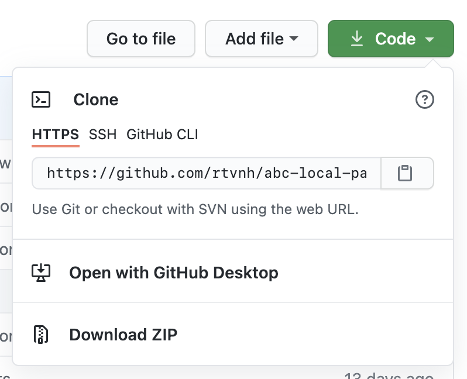
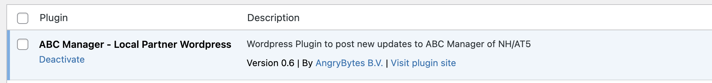
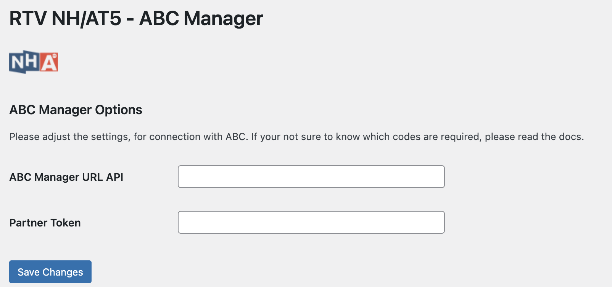

# ABC Manager - Lokale Partner - Wordpress Plug-in

Deze plugin zorgt voor een communicatie tussen Wordpress en ABC Manager. ABC Manager is het redactionele systeem van RTV
NH.

## Installatie

> Deze plug-in draait volgens minimale vereisten, verwacht wordt dat de applicatie (WordPress) in kwestie aan deze eisen voldoet.
> > PHP: **7.3** | WordPress: **5.7**

### Clonen van repository

Ga in uw WordPress applicatie naar de volgende folder `{wordpress installatie}/wp-content/plugins/` voer verolgens deze
actie uit: `git clone https://github.com/rtvnh/abc-local-partner-wp-plugin.git` er wordt een map aangemaakt:
**abc-local-partner-wp-plugin/** in deze folder staat nu de plug-in.

### Downloaden en handmatige installatie

Om deze plug-in te installeren dient deze repository gedownload te worden dat kan gedaan worden via het simpelweg
downloaden van deze plugin. Bovenaan staat er een mogelijkheid om deze te clonen, of hem op te downloaden als Zip
bestand. Kies in dit geval voor downloaden.

Indien de code rechtstreeks van GitHub wordt gedownload, dan dient deze zelf geplaatst te worden
in: `{wordpress installatie}/wp-content/plugins/`. Plaats de folder **abc-local-partner-wp-plugin/** op deze locatie.

## Plugin activeren

Om een werkende plugin te krijgen, dient deze geactiveerd te worden in het plug-ins overzicht.

## Configureren van de applicatie

In het configuratiescherm van de plugin zijn er 2 invoer velden die ingevuld moeten worden voor communicatie met de ABC
Manager omgeving van RTV NH. Zonder deze gegevens werkt de plugin niet.

### ABC Manager URL API

Om WordPress met ABC Manager te laten communiceren wordt er een request uitgevoerd naar de ABC Manager omgeving van RTV
NH, deze gegevens worden over het algemeen nooit gewijzigd. De URL wordt meegegeven bij het installeren van de
applicatie door RTV NH of Angry Bytes.

### Partner Token

Om duidelijk te kunnen valideren welke applicatie er communiceert met ABC Manager hebben wij een zogenoemde partner
token, deze zorgt er voor dat ABC Manager duidelijk weet welke applicatie er een bericht probeert te plaatsen. Indien
deze niet is ingevuld is, wordt er ook geen request naar ABC Manager uitgevoerd. De Partner Token is uniek voor uw
omroep/organisatie en niet universeel. Voor ABC Manager is het dan duidelijk onder welke omroep het bericht moet vallen.
---

## Werking plug-in

Iedere keer als er een nieuw bericht wordt geplaatst, dan wordt deze automatisch verstuurd (indien de gegevens zijn
ingevuld) naar ABC Manager. Wij ontvangen deze dan, en via een redactie wordt deze goed gekeurd of niet. Foto's/Videos
worden automatisch meegenomen. Er hoeft hier namens een redacteur/schrijver van uw omroep/organisatie geen extra actie
te worden gedaan.

### Fouten/Problemen

Mocht u niet uit deze documentatie komen, en heeft u hulp nodig? Neem dan alstublieft contact op
met [Angry Bytes](https://angrybytes.com) of met [RTV NH](https://www.nhnieuws.nl/contact).

&copy; RTV NH
